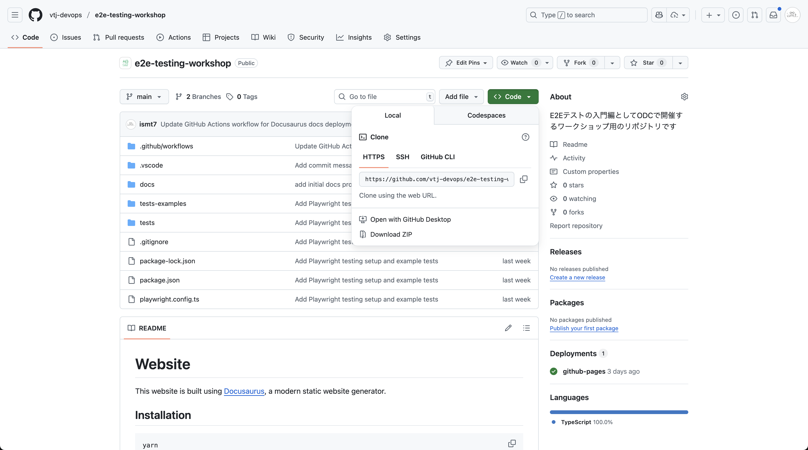

# GitHubからのクローン

このページでは、これからワークショップを進めるために必要なリポジトリをGitHubからクローンする手順を説明します。

:::note
この手順を始める前に、以下をご確認ください。

- Gitがインストールされていること([Git公式](https://git-scm.com/))

:::

## 流れ

### リポジトリのURLをコピー

まず、ワークショップのリポジトリページにアクセスし、リポジトリのURLをコピーします。通常、リポジトリページの右上に「Code」ボタンがあり、クリックするとURLが表示されます。



### ターミナルを開く

次に、ターミナル（コマンドプロンプトやPowerShellなど）を開きます。Windowsでは「cmd」や「PowerShell」、macOSやLinuxでは「Terminal」を使用します。

### クローン先のディレクトリに移動

クローンしたいディレクトリに移動します。例えば、ホームディレクトリにクローンしたい場合は以下のコマンドを使用します。

```bash
cd ~
``` 

### リポジトリをクローン

以下のコマンドを使用して、リポジトリをクローンします。`<repository-url>`は先ほどコピーしたURLに置き換えてください。

```bash
git clone <repository-url>
```

例:

```bash
git clone https://github.com/vtj-devops/e2e-testing-workshop.git
```

### クローンの確認

クローンが成功したか確認するために、以下のコマンドでディレクトリの内容を表示します。

```bash
cd <repository-name>
ls
```

`<repository-name>`はクローンしたリポジトリの名前に置き換えてください。`ls`コマンドはmacOS/Linuxの場合で、Windowsでは`dir`コマンドを使用します。
