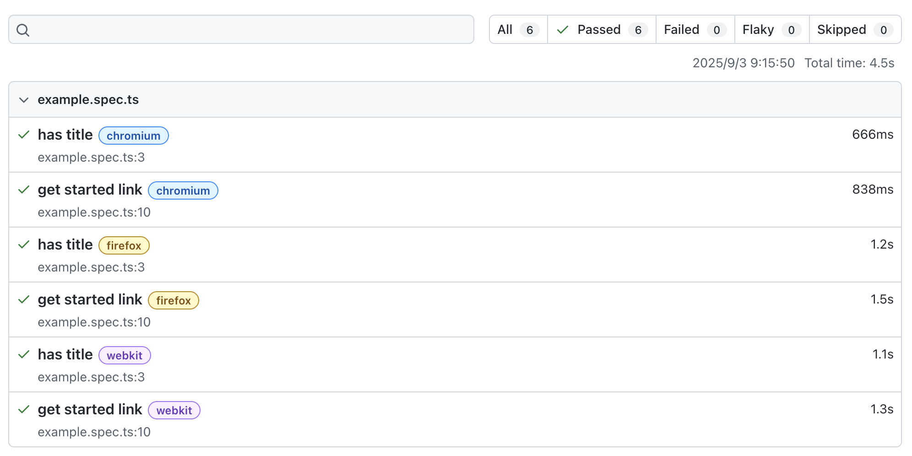

# レッスン 1: テストを実行してレポートを見る

最初に、ワークスペースに用意されているサンプルテスト（`tests/example.spec.ts`）を実行し、HTMLレポートを確認します。

## やること

テストの実行とレポート確認を行います。以下の手順を順に行ってください。

### テストを実行する

ルートからワークスペース全体のテストを実行します。

```bash
npx playwright test
```

### レポートを表示する

テストの結果がターミナルに表示されます。HTML レポートをブラウザで確認するには次を実行してください。

```bash
npx playwright show-report
```

ブラウザで開いたレポートから、各テストのステップ、スクリーンショット、トレースなど詳細を確認できます。


