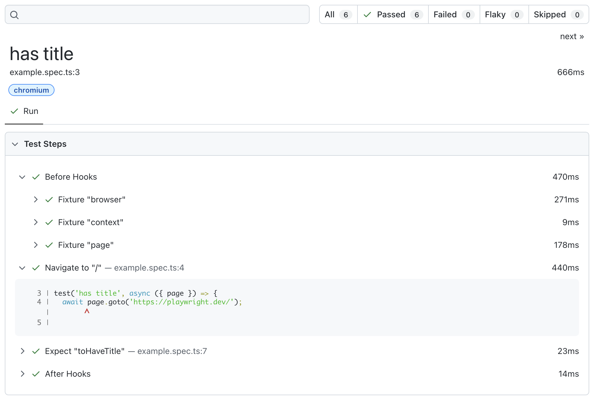

# レッスン 1: 実行してみよう

先ほど学んだPlaywrightコマンドを使って、実際にテストを実行してみましょう。既に`tests/example.spec.ts`というサンプルテストが用意されています。

## 手順

1. ターミナルで以下のコマンドを実行し、`tests/`フォルダ内のすべてのテストを実行します。

```bash
npx playwright test
```

2. テストが正常に実行されると、以下のような出力が表示されます。

```bash
Running 6 tests using 5 workers
  6 passed (4.5s)

To open last HTML report run:

  npx playwright show-report
```

3. ブラウザでテストレポートを確認するには、以下のコマンドを実行します。

```bash
npx playwright show-report
```


4. ブラウザでレポートが表示され、各テストの詳細な結果を確認できます。



## 次のステップ

次のレッスンでは、特定のテストファイルを実行する方法や、UIモードでの実行方法について学びます。
