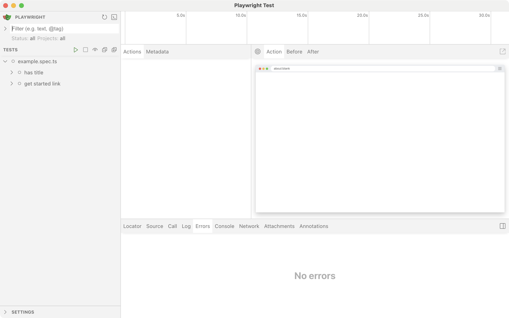
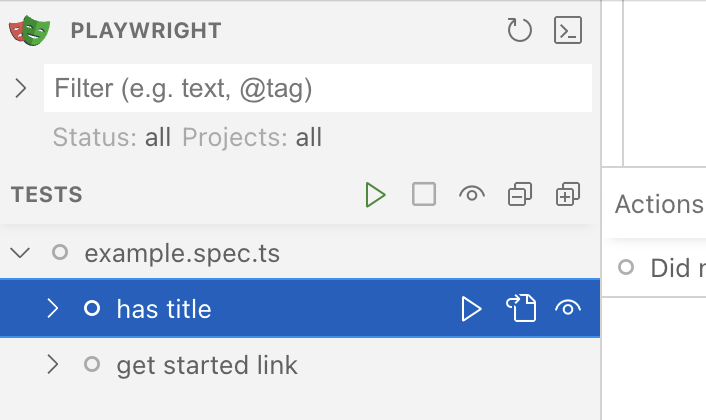
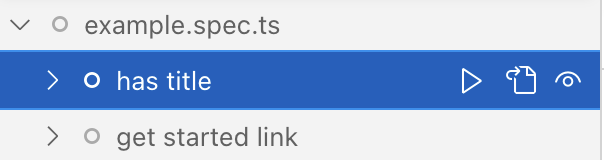
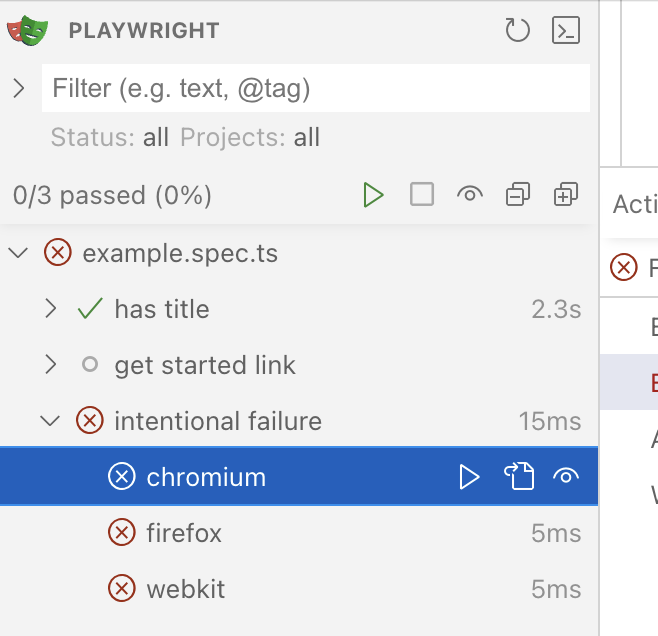
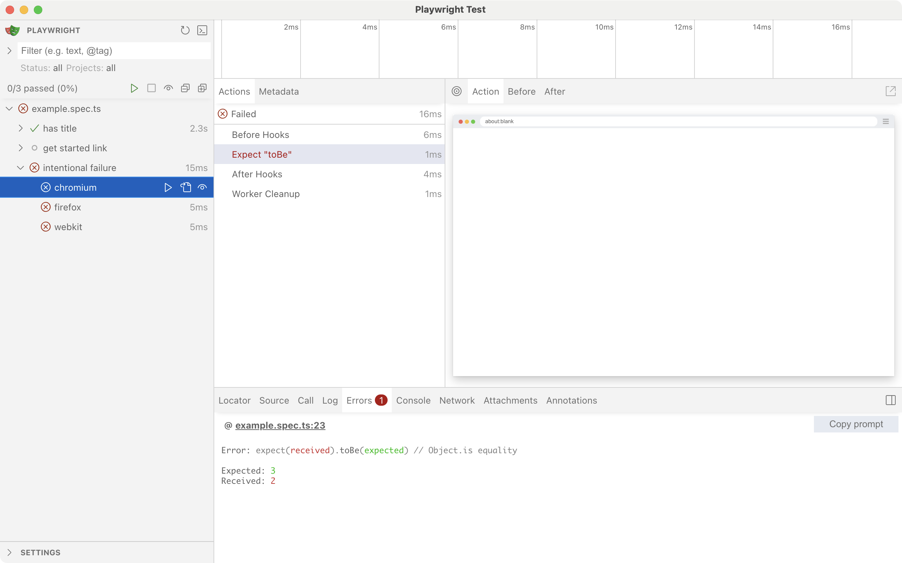

# レッスン 2: UIモードで実行してみよう

前のレッスンでは、ターミナルでコマンドを実行してテストを実行しました。今回は、Playwright Test の UI モードを使って、テストの選択、実行、デバッグを行う方法を学びます。

## 手順

ターミナルで以下のコマンドを実行し、Playwright Test の UI モードを起動します。

```bash
npx playwright test --ui
```

ブラウザが自動的に開き、Playwright Test の UI が表示されます。左側のパネルには、`tests/` フォルダ内のすべてのテストファイルが一覧表示されます。



実行したいテストファイルをクリックして選択します。



右上の「Run」ボタンをクリックして、選択したテストを実行します。



操作できる機能は、左から順に以下の通りです。

- テストの実行: 選択したテストを実行します。
- ソースコードの表示: 選択したテストファイルのソースコードを表示します。
- ウォッチ: ファイルの変更を監視し、自動的にテストを再実行します。

テストの実行が完了すると、各テストの結果が表示されます。成功したテストは緑色、失敗したテストは赤色で表示されます。



:::note
実際に同じように失敗するテストを体験したい場合は、`tests/example.spec.ts` に意図的に失敗するテストコードを追加しています。ワークショップの進行に合わせて、適宜コメントアウトしてください。
:::

失敗したテストをクリックすると、詳細なエラーメッセージやスタックトレースが表示されます。これにより、問題の原因を特定しやすくなります。



## 次のステップ

次のレッスンでは、Playwright の設定ファイル `playwright.config.ts` の基本的な設定方法について学びます。
