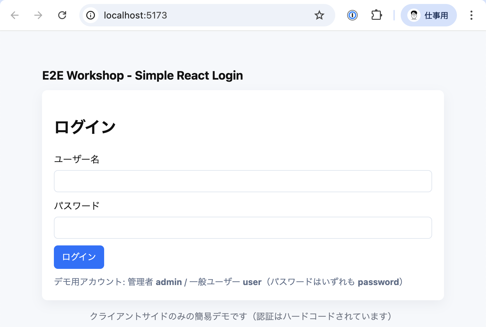

# レッスン 3: テスト対象アプリを起動する

ここでは、テスト対象のローカルアプリケーション（`web/`）を起動します。テストはブラウザからこのサーバーにアクセスするため、サーバーを先に立ち上げておきます。

## 手順

1. 新しいターミナルで `web/` に移動し、依存をインストールして起動します。

```bash
cd web
npm install
npm start
```

2. サーバーが起動したら、通常は `http://localhost:5173` にアクセスできます（起動ログでポートを確認してください）。



3. サーバーを起動したまま別のターミナルで Playwright のテストを実行してください（例: `npx playwright test`）。

## 補足
- 開発用サーバーは常に別ターミナルで動かすこと。CI ではテストランナーが起動スクリプトを呼び出してからテストを実行するのが一般的です。
