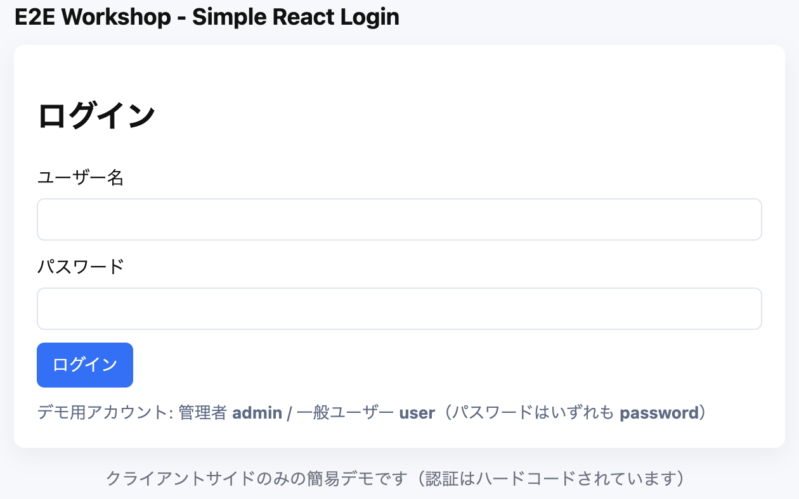

# レッスン 5: フォームに値を入力してログインする

テストで実際にログイン操作を行い、アプリケーションが期待通りに動作するかを確認します。

## 手順

`tests/example.spec.ts` で先に設定した `page.goto(...)` の下に、フォーム操作を追加します。

```typescript
// username と password を入力してログインボタンを押す
await page.fill('[data-testid="username-input"]', 'username');
await page.fill('[data-testid="password-input"]', 'password');
await page.click('[data-testid="login-button"]');
```

アサーションのテキストを変更すると、ログイン後の画面に切り替わったことを確認できます。

```typescript
await expect(page.locator('text=ようこそ')).toBeVisible();
```

コードの変更が終わったら、テストを実行して動作を確認します。

```bash
npx playwright test --ui
```



## テスト用セレクタについて

通常、IDやクラス名などを使って要素を特定することもありますが、これらはスタイル変更などで変わる可能性があり、テストが壊れやすくなります。また、テスト用途で依存することを避けるためにも、専用のセレクタを用意するのが望ましいです。

専用セレクターとして、`data-testid` 属性を使うことが一般的です。ワークショップ用のアプリケーションでは、主要な要素に `data-testid` が設定されています。次のセクションで主なセレクタをまとめていますので、必要に応じて参照してください。

## テスト用セレクタ一覧

ワークショップ用のアプリケーションで定義している主な `data-testid` セレクタは以下の通りです:

- `data-testid="username-input"` — ログインフォームのユーザー名入力
- `data-testid="password-input"` — ログインフォームのパスワード入力
- `data-testid="login-button"` — ログイン送信ボタン
- `data-testid="toggle-secret"` — ダッシュボードの秘密表示トグル
- `data-testid="logout-button"` — ログアウトボタン
- `data-testid="toggle-user-list"` — 管理者のユーザー一覧トグル（管理者のみ表示されます）

フォーム要素やボタンの待ち合わせには、次のように `waitForSelector` を使うと安定します:

```typescript
await page.waitForSelector('[data-testid="username-input"]');
```
