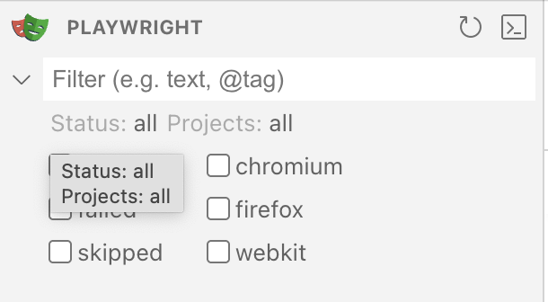

# Playwrightコマンドの基本操作

Playwrightコマンドを使って、様々な操作を行うことができます。このページでは、基本的なコマンドの使い方を説明します。

## よく使うコマンド一覧

### テストの実行

このコマンドで、`tests/` フォルダ内のすべてのテストが実行されます。

```bash
npx playwright test
```

:::note
もし、`npx playwright install` を実行していない場合、初回実行時にブラウザのインストールが求められます。指示に従ってインストールを完了してください。
:::

### 特定ファイルのテスト実行

このコマンドで、特定のテストファイルのみを実行できます。

```bash
npx playwright test tests/example.spec.ts
```

### UIモードでの実行

Playwright Test の UI モードを起動します。テストの選択、実行、デバッグが可能です。後のレッスンでも使用します。

```bash
npx playwright test --ui
```

:::tip[特定のブラウザーが表示されない場合]
UIモードで特定のブラウザが表示されない場合、フィルターをクリアしてみてください。


:::

ここに記載しているコマンド以外にも、様々なオプションがあります。詳細は公式ドキュメントを参照してください。
